# Mempool Garden

A collection of mempool diagram examples.

#### Key

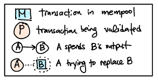

#### Basic Package Examples

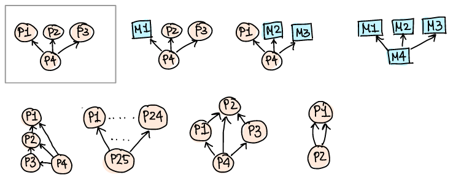

#### Ancestor and Descendant Limits

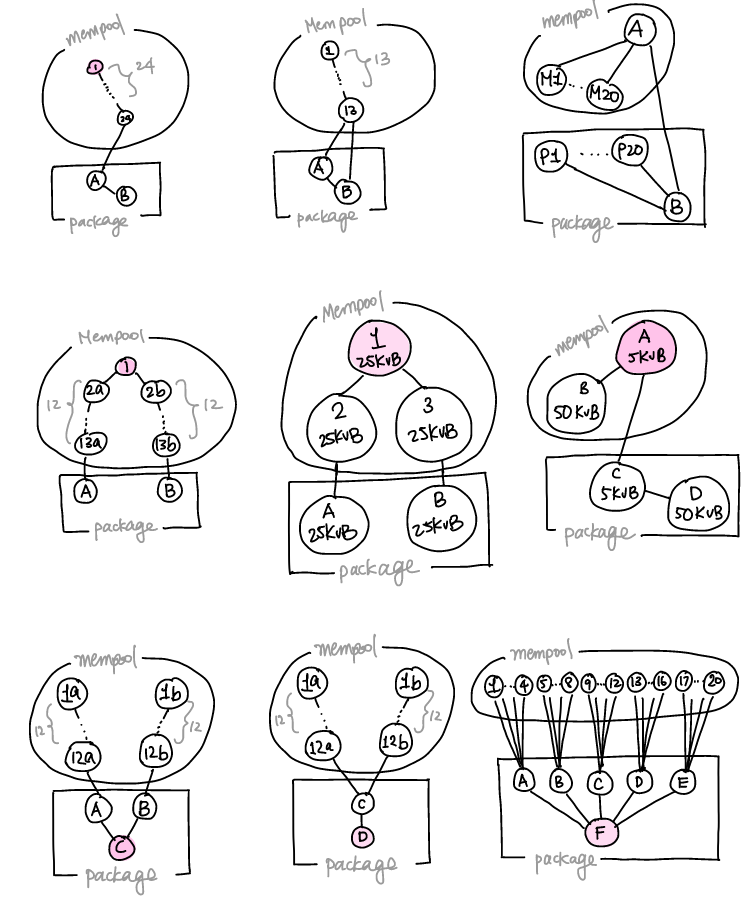

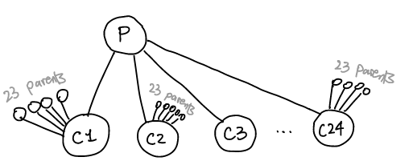

#### CPFP Carve Out

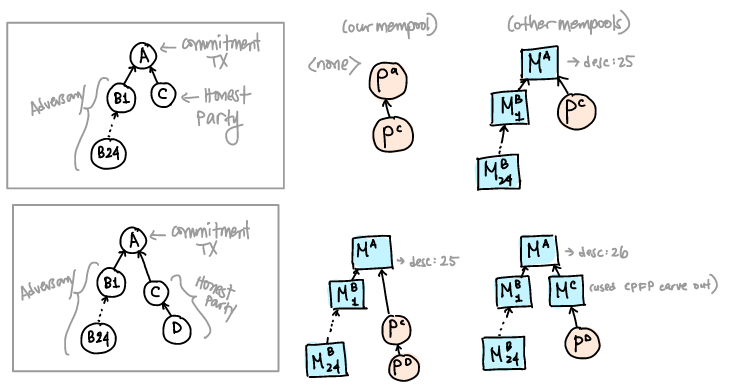

#### Combinatorics

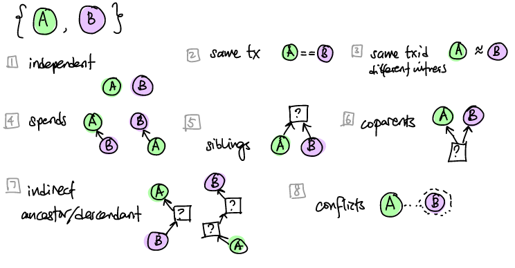

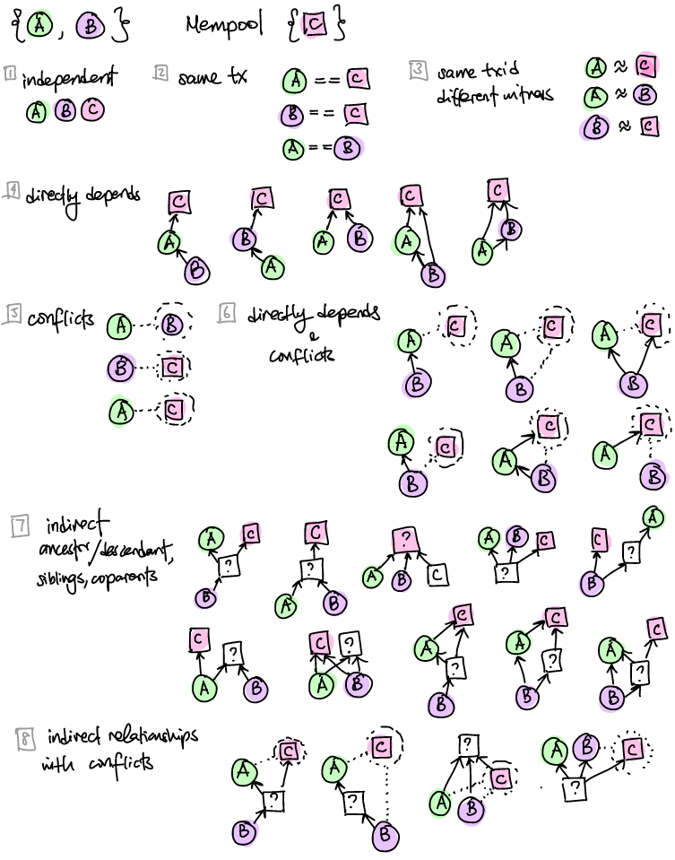

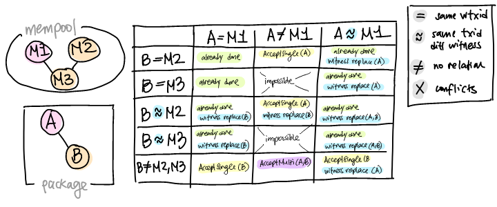

#### Rule 2 and Pinning

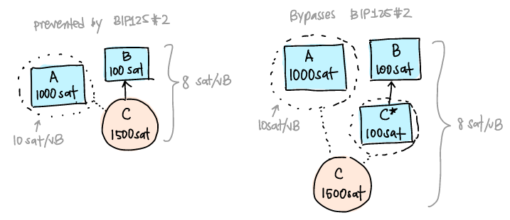

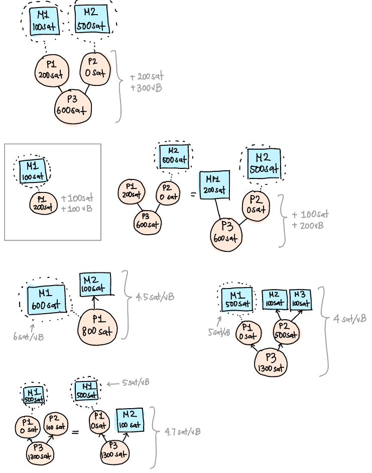

#### Revault and SIGHASH\_ANYONECANPAY Pinning

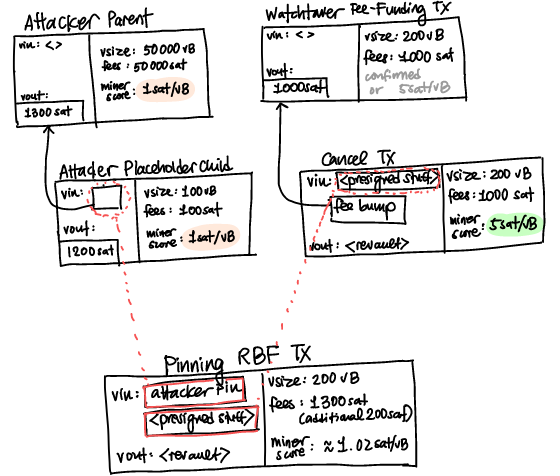

### Package Feerate

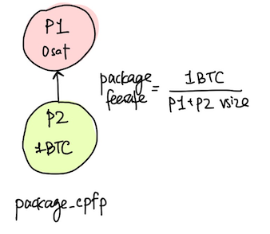

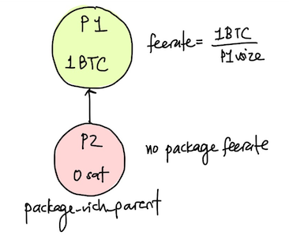

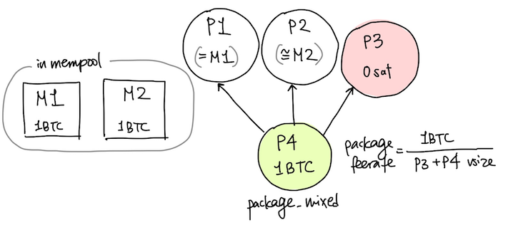

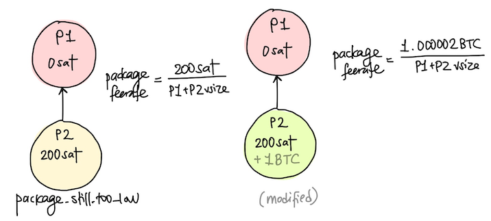

#### Incentives: Parent Pays for Child

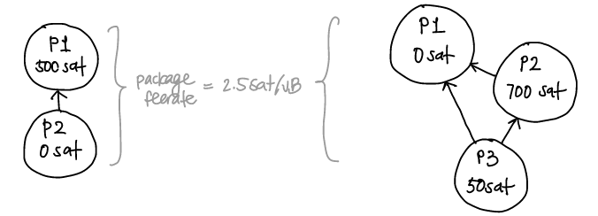

#### Incentives: Sibling Pays for Sibling

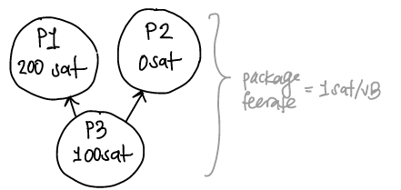

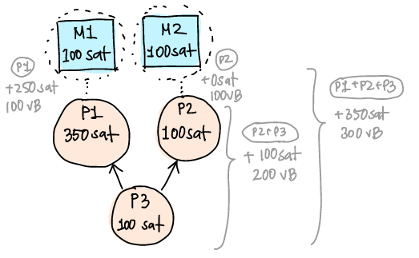

#### Ancestor Feerate is not Mining Score

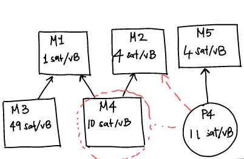

